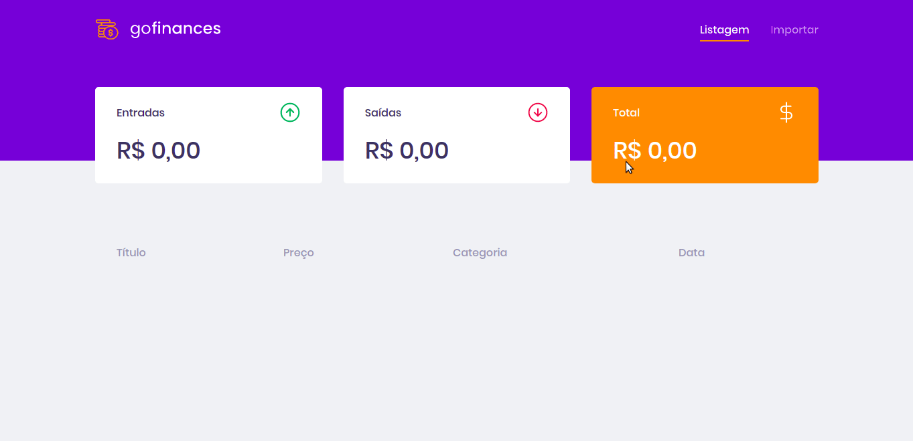

# :rocket: Sobre o desafio

Nesse desafio foi desenvolvido uma aplicação de gestão de transações, a GoFinances. Útil para praticar React.js junto com TypeScript, utilizando rotas e envio de arquivos por formulário.

Essa será uma aplicação que irá se conectar ao back-end [desafio-database-upload](https://github.com/marciofrancalima/desafio-database-upload), e exibir as transações criadas e permitir a importação de um arquivo CSV para gerar novos registros no banco de dados.



## Funcionalidades da aplicação

Caso queira ver o código para atingir os objetivos de cada funcionalidade, os arquivos estão na pasta `src`.

- **`Listar as transações da sua API`**: A página `Dashboard` deve ser capaz de exibir uma listagem através de uma tabela, com o campo `title`, `value`, `type` e `category` de todas as transações que estão cadastradas na sua API.

- **`Exibir o balance da sua API`**: A página `Dashboard` deve exibir o balance que é retornado do seu backend, contendo o total geral, junto ao total de entradas e saídas.

- **`Importar arquivos CSV`**: A página `Import` deve permitir o envio de um arquivo no formato `csv` para o backend, que irá fazer a importação das transações para o banco de dados.

**Dica**: Caso esteja no windows e esteja sofrendo com algum erro ao tentar importar CSV, altere o tipo de arquivo dentro do arquivo `components/upload/index.ts` de `text/csv` para `.csv, application/vnd.ms-excel, text/csv`.

### Específicação dos testes

Em cada teste tem uma breve descrição no que a aplicação deve cumprir. Os arquivos estão em `src/__tests__`.

Para esse desafio, temos os seguintes testes:

- **`should be able to list the total balance inside the cards`**: Para que esse teste passe, a aplicação deve permitir que seja exibido na sua Dashboard, cards contendo o total de `income`, `outcome` e o total da subtração de `income - outcome` que são retornados pelo balance do seu backend.

* **`should be able to list the transactions`**: Para que esse teste passe, a aplicação deve permitir que sejam listados dentro de uma tabela, toda as transações que são retornadas do seu backend.

**Dica**: Para a exibição dos valores na listagem de transações, as transações com tipo `income` devem exibir os valores no formado `R$ 5.500,00`. Transações do tipo `outcome` devem exibir os valores no formado `- R$ 5.500,00`.

- **`should be able to navigate to the import page`**: Para que esse teste passe, você deve permitir a troca de página através do Header, pelo botão que contém o nome `Importar`.

- **`should be able to upload a file`**: Para que esse teste passe, você deve permitir que um arquivo seja enviado através do componente de drag-n-drop na página de `import`, e que seja possível exibir o nome do arquivo enviado para o input.

## :calendar: Entrega

Esse desafio foi entregue pela plataforma Skylab da Rocketseat.

## :computer: Rodar a aplicação

Siga os procedimentos do back-end informado no início e, logo em seguida:

```bash
# Clone this repository
$ git clone https://github.com/marciofrancalima/desafio-fundamentos-reactjs.git (or use ssh)

# Go into the repository
$ cd desafio-fundamentos-reactjs

# Install dependencies
$ yarn install

# Run the tests
$ yarn test

# Run the app
$ yarn start
```

---

Made with ♥ by Márcio França Lima. [Contact me](https://www.linkedin.com/in/m%C3%A1rcio-fran%C3%A7a-lima-916454187/)
